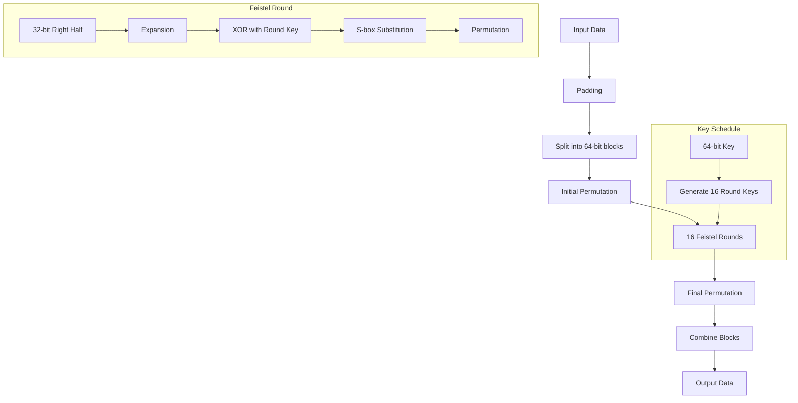

# DES (Data Encryption Standard) Implementation

A pure Python implementation of the DES (Data Encryption Standard) encryption algorithm. This implementation provides a clean, efficient, and easy-to-use interface for DES encryption and decryption without any external dependencies.

## Features

- Pure Python implementation
- No external dependencies
- Support for variable-length messages
- PKCS#7 padding
- Electronic Codebook (ECB) mode
- Binary data handling

## Installation

Simply copy the `des.py` file into your project directory.


### Working with Different Data Types

```python
# Working with strings
text = "Hello!"
encrypted = des.encrypt(text.encode())  # Convert string to bytes first
decrypted = des.decrypt(encrypted).decode()  # Convert bytes back to string

# Working with binary data
binary_data = b'\x00\x01\x02\x03\x04\x05'
encrypted = des.encrypt(binary_data)
decrypted = des.decrypt(encrypted)
```

## Implementation Details



### Key Classes and Methods

#### DES Class

- `__init__(key: bytes)`: Initialize with 8-byte key
- `encrypt(data: bytes) -> bytes`: Encrypt data
- `decrypt(data: bytes) -> bytes`: Decrypt data

### Internal Operations

1. **Key Schedule Generation**
   - Converts 64-bit key to 56 bits (removing parity)
   - Generates 16 48-bit round keys

2. **Block Processing**
   - Initial permutation
   - 16 rounds of Feistel network
   - Final permutation

3. **Padding**
   - PKCS#7 padding for non-64-bit aligned messages
   - Automatically handled during encryption
   - Removed during decryption

## Limitations

- Uses ECB mode only (identical blocks encrypt to identical ciphertext)
- No initialization vector support
- Key must be exactly 8 bytes


## Example Use Cases

### File Encryption

```python
def encrypt_file(input_path, output_path, key):
    des = DES(key)
    with open(input_path, 'rb') as f_in, open(output_path, 'wb') as f_out:
        data = f_in.read()
        encrypted = des.encrypt(data)
        f_out.write(encrypted)

def decrypt_file(input_path, output_path, key):
    des = DES(key)
    with open(input_path, 'rb') as f_in, open(output_path, 'wb') as f_out:
        data = f_in.read()
        decrypted = des.decrypt(data)
        f_out.write(decrypted)
```

### String Encryption

```python
def encrypt_string(text, key):
    des = DES(key)
    return des.encrypt(text.encode())

def decrypt_string(encrypted_data, key):
    des = DES(key)
    return des.decrypt(encrypted_data).decode()
```

