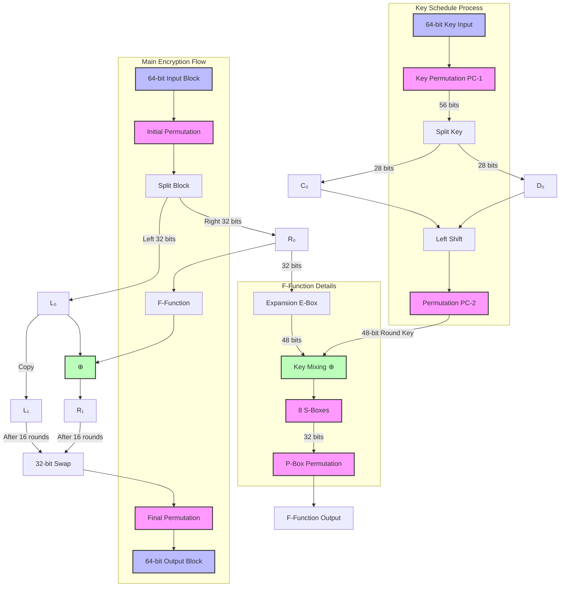

# DES (Data Encryption Standard) Implementation

A pure Python implementation of the DES (Data Encryption Standard) encryption algorithm. This implementation provides a clean, efficient, and easy-to-use interface for DES encryption and decryption without any external dependencies. https://page.math.tu-berlin.de/~kant/teaching/hess/krypto-ws2006/des.htm illustration was used for learning. 

## Features

- Pure Python implementation
- No external dependencies
- Support for variable-length messages
- PKCS#7 padding
- Electronic Codebook (ECB) mode
- Binary data handling

## Installation

Simply copy the `des.py` file into your project directory.


### Working with Different Data Types

Always ideal to operate on raw bytes but strings are also supported. 

## Implementation Details
This needs work.


### Key Classes and Methods

#### DES Class

- `__init__(key: bytes)`: Initialize with 8-byte key
- `encrypt(data: bytes) -> bytes`: Encrypt data
- `decrypt(data: bytes) -> bytes`: Decrypt data

### Internal Operations

1. **Key Schedule Generation**
   - Converts 64-bit key to 56 bits (removing parity)
   - Generates 16 48-bit round keys

2. **Block Processing**
   - Initial permutation
   - 16 rounds of Feistel network
   - Final permutation

3. **Padding**
   - PKCS#7 padding for non-64-bit aligned messages
   - Automatically handled during encryption
   - Removed during decryption

## Limitations

- Uses ECB mode only (identical blocks encrypt to identical ciphertext)
- No initialization vector support
- Key must be exactly 8 bytes


## Example Use Cases

### File Encryption

```python
python test.py
```


